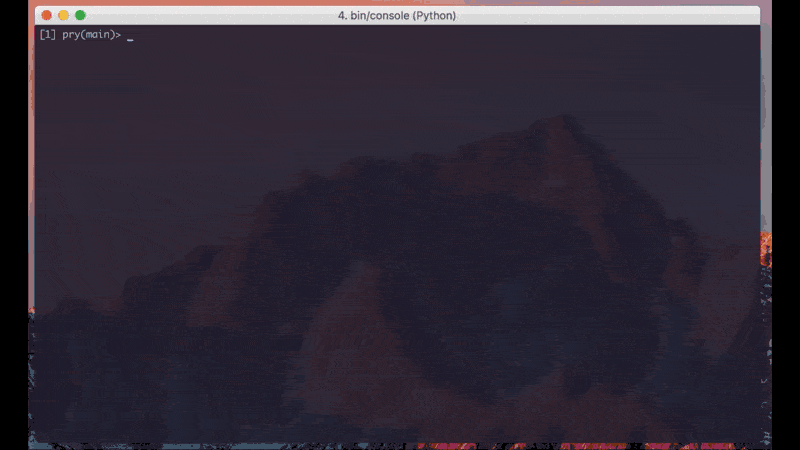

# Tukey

[](https://badge.fury.io/rb/tukey)

Tukey provides DataSets which can be put in a tree. This way you can store partial results of calculations or other data and, for example, create charts, tables or other presentations.


*John Tukey - Statistician and inventor of the 'bit'*

## Installation

Add this line to your application's Gemfile:

```ruby
gem 'tukey'
```

And then execute:

    $ bundle

Or install it yourself as:

    $ gem install tukey

# Usage

First a quick demonstration:




Then a quick example:

```ruby
    report = DataSet.new(label: 'Year star report')

    report << DataSet.new(label: "January", data: 0)
    report << DataSet.new(label: "February", data: 30)
    report << DataSet.new(label: "March", data: 40)
    report << DataSet.new(label: "April", data: 50)

    # Get a total:
    report.sum # => 120
    report.average # => 30.0

    # Labels of all leafs
    # (useful when creating tables and charts, more on that later):
    report.leaf_labels.map(&:name) # => ["January", "February", "March", "April"]

    # Value of single children:
    report.children.first.value # => 0

    # Useful development output:
    puts report.pretty_inspect
    #=> * Year star report
    #    |- January: 0
    #    |- February: 30
    #    |- March: 40
    #    |- April: 50

    # Filtering:
    # (can be far more advances, more on that later)
    report.filter { |p, set| set.value >= 40 }
    #=> * Year star report
    #  |- March: 40
    #  |- April: 50

    # Combining:
    report2 = DataSet.new(label: "Yearly star report")
    report2 << DataSet.new(label: 'January', data: 10)
    report2 << DataSet.new(label: 'May', data: 60)
    report2 << DataSet.new(label: 'June', data: 70)

    report.combine(report2, :+)
    #  * Year star report
    # |- January: 10     # <= Note the added 10
    # |- February: 30
    # |- March: 40
    # |- April: 50
    # |- May: 60
    # |- June: 70
```

## Development

After checking out the repo, run `bin/setup` to install dependencies. Then, run `rake spec` to run the tests. You can also run `bin/console` for an interactive prompt that will allow you to experiment.

To install this gem onto your local machine, run `bundle exec rake install`. To release a new version, update the version number in `version.rb`, and then run `bundle exec rake release`, which will create a git tag for the version, push git commits and tags, and push the `.gem` file to [rubygems.org](https://rubygems.org).

## Contributing

Bug reports and pull requests are welcome on GitHub at https://github.com/abuisman/tukey.


## License

The gem is available as open source under the terms of the [MIT License](http://opensource.org/licenses/MIT).

